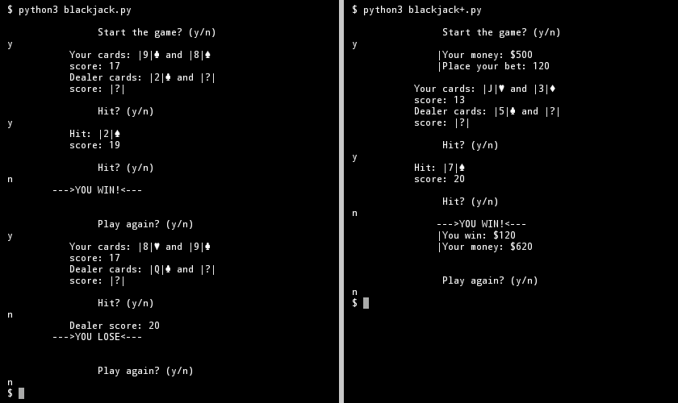

# Blackjack

The terminal based version of the [Blackjack](https://en.wikipedia.org/wiki/Blackjack) casino game in Python.

### Planned
- create a second version with bets
- optimization code

### Bugs
- issuing the same cards. That is, cards are copied from the finished linkedlist, rather than extracted from it
- poorly worked logic of the |A|ce. When you re-take the card, the |A|ce does not change the value already recorded in the player's array